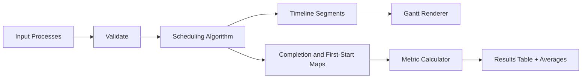

# CPU Scheduling Studio

Interactive CPU scheduling simulator focused on correctness, algorithm comparison, and transparent metric reporting.

## Features

- Editable process table with per-row validation.
- Algorithms:
  - First Come, First Served (FCFS)
  - Shortest Job First (SJF, non-preemptive)
  - Shortest Remaining Time First (SRTF, preemptive)
  - Round Robin (configurable quantum)
- Timeline (Gantt chart) with idle segments included.
- Workload import/export as JSON for reproducible comparisons.
- Copy Decision Brief turns the current workload fingerprint, tuned scheduler choice, and per-process outcome summary into a clipboard-ready note.
- Compare-all benchmark table across FCFS, SJF, SRTF, and RR for the same workload.
- Added a starvation-watch workload preset for contrasting long-running jobs against steady short arrivals.
- Workload fingerprint panel that estimates convoy risk, burst skew, and the likely best scheduling family before a run.
- Automatic workload coach that flags convoy pressure, response-time tradeoffs, and context-switch overhead after each run.
- Service posture board classifies whether the current scheduler is behaving more like an interactive, batch-heavy, or mixed policy.
- Per-process metrics:
  - Completion time
  - Turnaround time
  - Waiting time
  - Response time
- Aggregate averages for quick comparison.
- Fairness spread readout to show how uneven waiting time is across the workload.
- Slowdown metric to surface which process got stretched furthest relative to its own burst time.
- Starvation watch that flags processes with severe wait-to-work imbalance.
- Process pressure map classifies each process as interactive-friendly, batch-heavy, balanced, or at-risk after a run.
- Tail-risk board identifies which process absorbs the worst wait pain versus the worst slowdown pain.
- Preemption watch calls out when the workload actually wants interrupt-friendly scheduling rather than a simpler non-preemptive baseline.
- Round Robin quantum coach that turns the sweep table into an explicit tuning recommendation.
- Scheduler settings now stay in the shareable URL while you tune algorithm, quantum, and context-switch cost.
- Dispatch audit summarizes idle gaps, process handoffs, context-switch segments, and shortest run length after each simulation.

## Technical Design

- `index.html`: semantic app layout, controls, and output sections.
- `style.css`: responsive visual system and accessible tables.
- `script.js`: deterministic scheduling logic + rendering layer.



## Usage

1. Add or edit processes with arrival/burst values.
2. Choose an algorithm.
3. For Round Robin, set a quantum.
4. Click `Run Simulation`.

## Local Run

```bash
python -m http.server 8000
```

Then open `http://localhost:8000`.

## Portfolio Demo Path

1. Load the `Starvation Watch Preset`.
2. Run the current scheduler, then use `Compare All`.
3. Sweep Round Robin quantums to show fairness versus overhead.
4. Copy the decision brief for a reproducible scheduler recommendation.
5. Read the tail-risk board so the demo names who actually paid for the average metric.

## GitHub Pages Compatibility

- No server/runtime dependency.
- Relative static assets only.
- Deploy by publishing repository root via GitHub Pages.

## Future Improvements

- Priority scheduling and multilevel feedback queue.
- Context-switch overhead visualization.
- Add per-segment hover detail for timeline slices and context-switch intervals.
