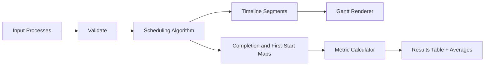

# CPU Scheduling Studio

Interactive CPU scheduling simulator focused on correctness, algorithm comparison, and transparent metric reporting.

## Features

- Editable process table with per-row validation.
- Algorithms:
  - First Come, First Served (FCFS)
  - Shortest Job First (SJF, non-preemptive)
  - Shortest Remaining Time First (SRTF, preemptive)
  - Round Robin (configurable quantum)
- Timeline (Gantt chart) with idle segments included.
- Workload import/export as JSON for reproducible comparisons.
- Compare-all benchmark table across FCFS, SJF, SRTF, and RR for the same workload.
- Automatic workload coach that flags convoy pressure, response-time tradeoffs, and context-switch overhead after each run.
- Per-process metrics:
  - Completion time
  - Turnaround time
  - Waiting time
  - Response time
- Aggregate averages for quick comparison.

## Technical Design

- `index.html`: semantic app layout, controls, and output sections.
- `style.css`: responsive visual system and accessible tables.
- `script.js`: deterministic scheduling logic + rendering layer.



## Usage

1. Add or edit processes with arrival/burst values.
2. Choose an algorithm.
3. For Round Robin, set a quantum.
4. Click `Run Simulation`.

## Local Run

```bash
python -m http.server 8000
```

Then open `http://localhost:8000`.

## GitHub Pages Compatibility

- No server/runtime dependency.
- Relative static assets only.
- Deploy by publishing repository root via GitHub Pages.

## Future Improvements

- Priority scheduling and multilevel feedback queue.
- Context-switch overhead visualization.
- Import/export JSON workloads for reproducible benchmarks.
